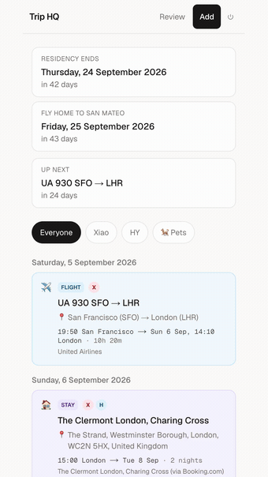
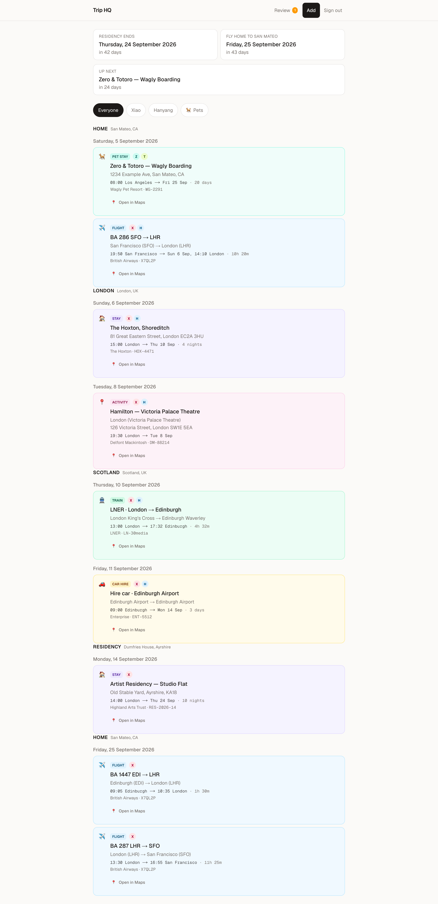
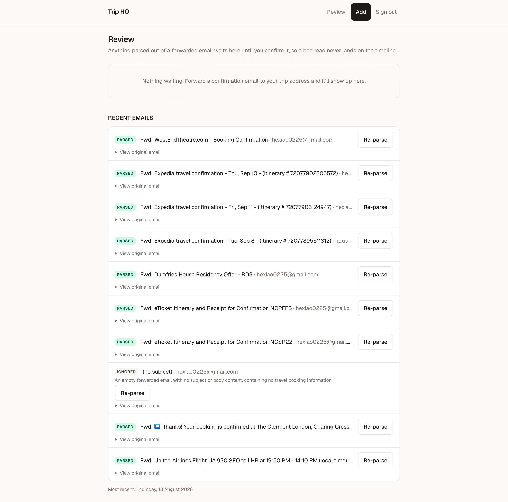
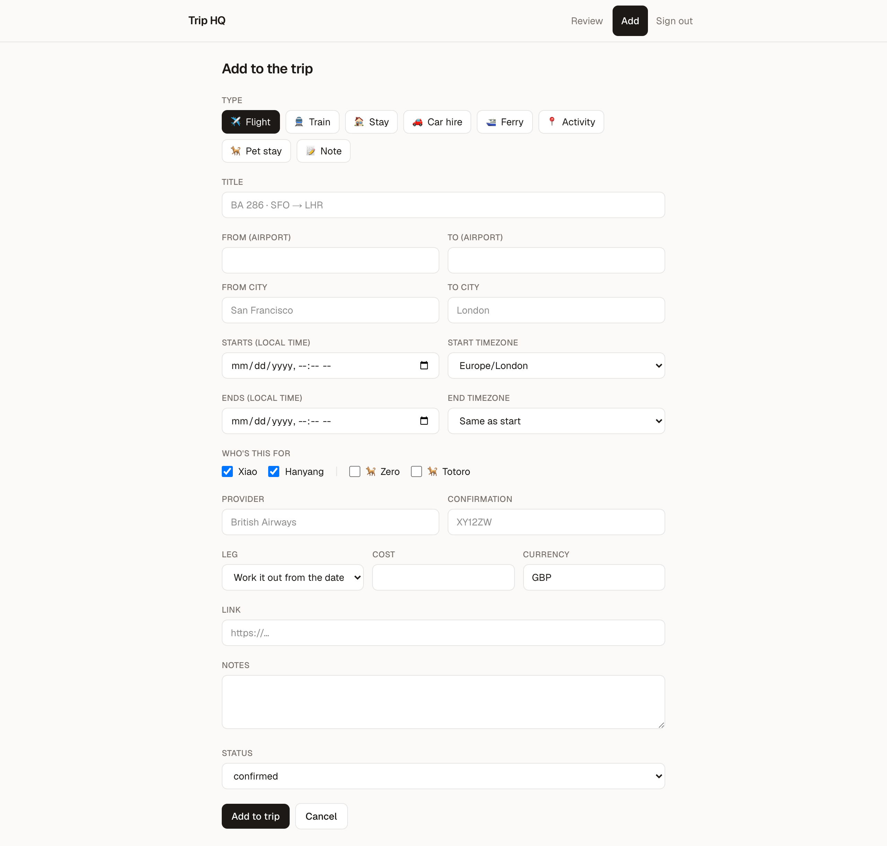
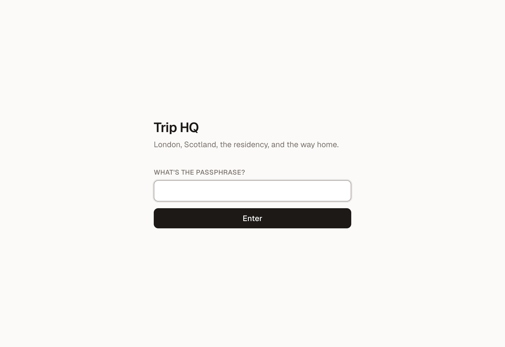

# Trip HQ

A private trip planner for two people and two dogs. Every trip you're planning
lives here side by side — London → Scotland → an artist residency at Dumfries
House → Beijing in one, Singapore in the next — each with its own legs,
bookings and countdowns.

Forward a booking confirmation to a dedicated email address and it parses itself
into the itinerary, working out which trip it belongs to on the way in.
Everything is shown in the local time of the place it happens, which matters
when a single day spans Pacific, British and Singapore time.

<p align="center">
  
</p>

<p align="center">
  <sub>
    <a href="docs/screenshots/demo.mp4">Full-resolution video</a> · real bookings,
    with names and confirmation numbers masked
  </sub>
</p>

---

## What it does

- **Many trips, one app.** Each trip has its own timeline, map, review queue
  and settings, under `/t/<trip>`. The header switches between them and shows
  which one is under way, which is next, and where bookings are waiting.
- **One timeline per trip.** Flights, stays, car hire, trains, activities, pet
  boarding and notes in a single list, grouped by day and by leg of the trip.
- **Correct local times.** Each booking stores the instant *and* the timezone it
  should be read in. A San Francisco → London flight shows a 19:50 departure and
  a 14:10 arrival the next day, with the true 10h 20m between them.
- **Email ingestion that files itself.** Forward a confirmation; Claude reads it
  into structured bookings, works out which trip it belongs to from the dates
  and the destination, and leaves it in that trip's review queue until you
  accept it.
- **Per-person views.** Filter to one traveler for the stretch where you're in
  different countries — or to the dogs, whose boarding runs alongside the trip.
- **Built for a phone.** This is used standing in an airport, not at a desk.

<p align="center">
  
</p>

---

## Using the app

### Start a trip

**New trip** asks for a name, roughly when, and who's going. That's enough to
start forwarding bookings to it.

Its **Settings** page is where the rest goes:

- **Legs** — the stretches the trip breaks into, each with a place, a timezone
  and a date range. Give a leg dates and anything booked inside them groups
  under that heading by itself. Leave them blank while they're undecided.
- **Milestones** — the fixed points the trip is planned around, shown as
  countdowns at the top of the timeline. With none set, the trip's own start
  date is the countdown.
- **Colour, mark and currency** — how the trip reads in the switcher, and what
  a new booking's cost field starts as.

A finished trip can be **archived**, which takes it out of the switcher and
keeps everything on it. Deleting is separate, asks for the trip's name typed
out, and takes the bookings with it.

### Forward a booking

Send any confirmation email to your inbound address. Nothing else is needed — no
special subject line, and Gmail's `---------- Forwarded message ----------`
wrapper is ignored. Airlines, hotels, rail operators, Expedia and theatre
bookings have all been parsed from their original emails without tailoring.

A round trip becomes two flights rather than one row. A booking that names only
one of you is assigned to only that person. Prices, seat numbers, confirmation
numbers, addresses and phone numbers are pulled out when the email states them —
and left blank when it doesn't, rather than guessed.

The trip is worked out the same way: the model is told which trips exist and
picks one on the dates and the destination. When nothing fits — the trip has no
dates yet, or the email is ambiguous — the booking is left unfiled rather than
put somewhere wrong, and appears under **Waiting for a trip** in every trip's
review queue until you choose.

### Review before it lands

Nothing appears on a timeline automatically. Parsed bookings wait under
**Review**, where you can:

- **Add to timeline** — accept it as-is.
- **Edit first** — fix a detail, then save.
- **Move** — file it under a different trip.
- **Discard** — drop a bad read.

The same screen lists every email received, with its parse status and a **View
original email** toggle showing the source text — useful for working out why
something parsed oddly.

<p align="center">
  
</p>

### Read the timeline

Each card is colour-tinted by type, so the trip is scannable while thumbing
down it:

| | | | |
|---|---|---|---|
| ✈️ Flight | 🏠 Stay | 🚆 Train | 🚗 Car hire |
| ⛴️ Ferry | 📍 Activity | 🐕 Pet stay | 📝 Note |

Every card carries an **Open in Maps** link, which prefers a street address and
falls back to the destination — one tap from the back of a taxi. Tapping the
card itself opens the full detail, including anything extra the parser found:
seat numbers, check-in windows, contact names, reception phone numbers.

### Filter

**Everyone · Xiao · Hanyang · 🐕 Pets** — the dogs share one tab, but stay
individually assignable, since a vet visit is usually for just one of them.
Only the people actually on the trip get a tab, so a solo trip doesn't offer a
filter that always comes back empty.

### Add something by hand

Not everything arrives by email. The **Add** form adapts to the type you pick —
a stay asks for an address and check-in/check-out, a flight asks for airports
and a separate arrival timezone.

<p align="center">
  
</p>

### Signing in

One shared security question, answered once per device and remembered for 60
days.

<p align="center">
  
</p>

---

## Tech stack

| Layer | Choice | Why |
|---|---|---|
| Framework | **Next.js 16** (App Router, React 19) | Server Components keep the data on the server; Server Actions mean no separate API layer for forms. |
| Language | **TypeScript** (strict) | |
| Styling | **Tailwind CSS v4** | Light-mode only, with a warm neutral palette. |
| Database | **Postgres** (Neon) via **Drizzle ORM** | Typed queries and a schema-as-code migration path. |
| Driver | **postgres.js** | Speaks plain Postgres, so the same code runs against a local server in development and Neon's pooler in production. |
| Parsing | **Claude** (`claude-opus-5`) via the Anthropic SDK | Structured outputs with a Zod schema, so the model returns validated objects rather than text to regex. |
| Dates | **Luxon** | Real IANA timezone handling — the whole app depends on getting this right. |
| Hosting | **Vercel** | |

---

## How it works

### The ingestion pipeline

```
forwarded email
  → provider webhook  (Postmark / CloudMailin / Resend / SendGrid / Cloudflare)
  → POST /api/inbound/email      normalise the payload, store the raw email
  → respond 200 immediately      providers time out in seconds
  → after()                      parse with Claude in the background
  → match to a trip              by the model's read, then by date
  → review queue                 wait for a human
```

Four decisions worth knowing about:

**The raw email is stored before the model runs.** A failed parse keeps the
booking and offers a re-parse, rather than asking anyone to forward it again.

**The webhook is provider-agnostic.** It understands Postmark, CloudMailin,
Resend, SendGrid and a plain JSON post from a Cloudflare Email Worker, so
switching providers is a settings change rather than a code change.

**Nothing is auto-accepted.** A misread can't quietly corrupt an itinerary.

**An unmatched booking is kept, not placed.** The model names a trip or returns
nothing, and a date-range match is the only fallback. Filing a Singapore hotel
under the UK trip is worse than leaving it in a queue that says so.

### Times and timezones

The model returns local wall-clock times plus an IANA zone name — never UTC.
Confirmation emails state local times, so converting here against a real
timezone database avoids a whole category of off-by-an-hour bugs.

Times are labelled with a **city** rather than a timezone abbreviation
("19:50 San Francisco"), because abbreviations can't be rendered correctly for
every zone at once: `en-US` gives "PDT" but "GMT+1" for London, while `en-GB`
gives "BST" but "GMT-7" for Los Angeles. A city name is never ambiguous.

### Duplicate bookings

Airlines send the itinerary and the receipt as separate emails. Forwarding both
merges rather than duplicating — matched on confirmation number **and** exact
departure instant, within one trip, since a round trip shares one reference
across its legs. The merge fills gaps rather than overwriting, so the fare that
only the receipt carried survives and hand-edited fields are left alone.

### Access

One shared answer, hashed into an HMAC-signed cookie and checked in `proxy.ts`
using Web Crypto so it runs on the edge runtime. The inbound webhook is exempt
and authenticates with its own shared secret.

---

## Setup

```bash
npm install
cp .env.example .env.local   # then fill in the values
npm run db:push              # create the tables
npm run dev
```

| Variable | What it's for |
| --- | --- |
| `DATABASE_URL` | Postgres connection string. Use the **pooled** one from Neon (the host contains `-pooler`). |
| `APP_PASSCODE` | The answer to the sign-in question. The question itself lives in `src/lib/config.ts`. |
| `AUTH_SECRET` | Signs the session cookie. `openssl rand -base64 32` |
| `ANTHROPIC_API_KEY` | Parses forwarded emails. |
| `INBOUND_WEBHOOK_SECRET` | Shared secret the email webhook must present. `openssl rand -hex 24` |

Schema changes are applied with `npm run db:push`, which diffs
`src/lib/db/schema.ts` against the database directly. There is no migrations
folder to keep in sync.

### Upgrading an existing database to multiple trips

A database from before trips were rows needs one extra step. `db:push` adds the
new tables and columns; the script then creates the original trip, turns its
legs and milestones into rows, and files every existing booking under it.

```bash
npm run db:push
npm run db:migrate-trips -- --dry   # print what it would do
npm run db:migrate-trips            # do it
```

It's safe to run more than once — it matches on slug and only fills in what's
missing. It also creates an empty **Singapore** trip to start from; pass
`--no-seed` to skip that.

## Deploying

```bash
npx vercel link
npx vercel env add DATABASE_URL production   # repeat for each variable above
npx vercel --prod
```

Run `npm run db:push` once against the production database before first use —
and `npm run db:migrate-trips` too, if it already holds a trip's bookings.

> Set environment variables with `vercel env add` and type the value at the
> prompt. Piping a file into it stores the file's trailing newline as part of
> the value, which silently breaks any comparison that uses it.

## Connecting the email address

Point your provider's inbound webhook at:

```
https://<your-app>.vercel.app/api/inbound/email?token=<INBOUND_WEBHOOK_SECRET>
```

Opening that URL in a browser returns `{"ok":true}` when the secret is right —
a quick way to check the wiring.

- **[Postmark](https://postmarkapp.com)** gives a free
  `@inbound.postmarkapp.com` address with no domain required, but its signup
  rejects consumer email domains.
- **[CloudMailin](https://www.cloudmailin.com)** has no such restriction — a
  personal address works. Set the format to **JSON**.
- If you own a domain, **Cloudflare Email Routing** can forward a nicer address
  (`trips@yourdomain.com`) to either of the above.

## Making it yours

Trips, legs and milestones are edited in the app — **New trip**, then that
trip's **Settings**. Nothing about a destination lives in code.

`src/lib/config.ts` holds only what's the same for every trip:

- **Who** — travelers and pets, their names and badge colours.
- **The sign-in question.**
- **Home timezone** and the base timezone list, which each trip's own zones are
  added to.

## Scripts

| Command | |
| --- | --- |
| `npm run dev` | Development server |
| `npm run build` | Production build |
| `npm run typecheck` | `tsc --noEmit` |
| `npm run lint` | ESLint |
| `npm run db:push` | Apply `schema.ts` to `DATABASE_URL` |
| `npm run db:migrate-trips` | One-time move to multiple trips. `--dry` to preview |

---

> The still screenshots use invented sample data. The walkthrough at the top
> shows a real trip, with one traveler's name shortened and every confirmation
> number removed — from the cards, the detail rows and the email subjects that
> quoted them.
